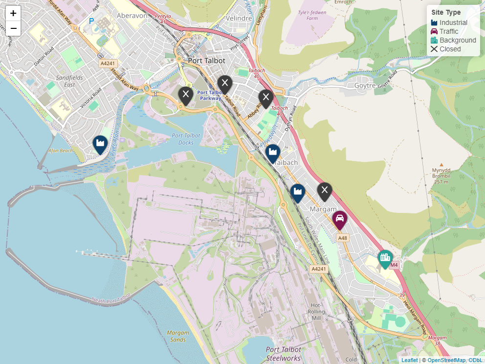

# leaf.magick

<!-- badges: start -->
[](https://CRAN.R-project.org/package=leaf.magick)
[](https://github.com/jack-davison/leaf.magick/actions/workflows/R-CMD-check.yaml)
<!-- badges: end -->

The goal of leaf.magick is to overcome the somewhat outdated "Font Awesome" implementation in vanilla R `{leaflet}` by constructing markers on the fly using `{fontawesome}` and `{magick}`. There are three issues `{leaf.magick}` sets out to overcome:

* `awesomeIcons()` is limited to Font Awesome 4; `{fontawesome}` gets updated to use the most up-to-date icon set.

* `awesomeIcons()` is limited to a handful of discrete colours; `{fontawesome}` can use effectively *any* colour.

* Vanilla `{leaflet}` doesn't provide any additional features to construct legends, icon palettes, or such like.

`{leaf.magick}` attempts to solve all of this.

## Installation

You can install the development version of `{leaf.magick}` like so:

``` r
# install.packages("pak")
pak::pak("jack-davison/leaf.magick")
```




